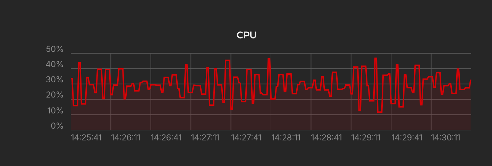

import Image from '../../components/reads/Image.astro'
import coverImage from '../../assets/reads/supabase-self-host-docker-caddy-reverse-proxy.jpg'

Self-hosting **Supabase** is quite a task on its own, but when it comes to **running it behind a reverse proxy**, things can get even trickier. In this guide, I'll show you how I self-host Supabase with Docker and **Caddy** as a reverse proxy running on a Hetzner Cloud VPS.

<Image
  src={coverImage}
  alt='A silhouette of a person sitting at a desk with three monitors displaying code and graphs. Above them, a glowing digital cloud hovers, symbolizing cloud computing, with connected lines and data points. The scene is set against a dark background with neon colors, suggesting a focus on technology and data infrastructure.'
  caption="Building Your Own Supabase: A Step-by-Step Guide to Self-Hosting with Docker and Caddy as a Reverse Proxy."
  lazy={false}
/>

## The Approach

The idea is to run the Supabase stack behind Caddy. This way, we can have a single entry point for all our services and let Caddy manage our SSL certificates automatically. One of the requirements is to have other services running on the same VPS, which is why we need Caddy as a reverse proxy.

Here's a high-level overview of the setup:

1. **VPS**: We'll use a Hetzner Cloud VPS running Ubuntu with Docker.
2. **Supabase**: This will be our backend as a service, running in a Docker Compose stack.
3. **Caddy**: Our reverse proxy will be running in a separate Docker Compose stack. It handles SSL certificates and routes traffic to our indidual services.
4. **App Service**: This is our custom application running also in a Docker Compose stack.
5. **Shared Network**: All services will be running on the same Docker network to communicate with each other.
6. **Firewall**: We'll configure the firewall to only allow HTTP and HTTPS traffic going to Caddy, not the Supabase services directly.

## Hetzner Cloud VPS

For this experiment I created a **Hetzner Cloud VPS** of type `CAX11`, which is the cheapest option they have. You might want to upgrade this for your production setup, since the **idle** Supabase stack with no traffic hitting it all already consumes around **30-40% of the CPU**.



## Supabase Setup

Follow the official Self-Hosting Guide to set up Supabase on your VPS. You can find the guide [here](https://supabase.com/docs/guides/self-hosting/docker).

The Supabase Studio should now already be reachable on your VPS on port `8000`. We will deal with this later.

## Caddy Setup

Caddy will be our reverse proxy, handling SSL certificates and routing traffic to our services. We will run Caddy in a separate Docker Compose stack. Here's the `docker-compose.yml` file:

```yaml {13, 16-17, 23-27}
# docker-compose.yml
services:
  caddy:
    image: caddy:2
    restart: unless-stopped
    cap_add:
      - NET_ADMIN
    ports:
      - "80:80"
      - "443:443"
      - "443:443/udp"
    volumes:
      - $PWD/Caddyfile:/etc/caddy/Caddyfile
      - caddy_data:/data
      - caddy_config:/config
    networks:
      - proxy-network

volumes:
  caddy_data:
  caddy_config:

networks:
  proxy-network:
    name: proxy-network
    external: true
```

There are two things here that are important:

1. Mount the `Caddyfile` right next to the `docker-compose.yml` file. This file will contain the configuration for Caddy.
2. Create an external/shared Docker network called `proxy-network` that all services will be part of.

### Caddyfile

Let's create the `Caddyfile` next to the `docker-compose.yml` file:

```plaintext {7}
# Caddyfile
app.flori.cloud {
    reverse_proxy app:80
}

supabase.flori.cloud {
    reverse_proxy supabase-kong:8000
}
```

In the `Caddyfile` we have **seperate domains** pointing to our different services. The `app` service is our custom application, and `supabase-kong` is the name of the Supabase entrypoint and basically a reverse proxy on its own.

So whenever a request comes in for `app.flori.cloud`, Caddy will route it to the `app` service on port `80`. The same goes for `supabase.flori.cloud` and the `supabase-kong` service on port `8000`.

Since Caddy does automatic SSL certificate management, you don't have to worry about that. When I hit `https://supabase.flori.cloud` for the first time, Caddy had already issued a Let's Encrypt certificate for it.

### Shared Network

As you can see above we are routing traffic to `app` and `supabase-kong`. These are the service names in the involved Compose stacks and get resolved by Docker itself. To make this work, we need to have **all services in the same Docker network**. This is why we created the `proxy-network` network in the Caddy's `docker-compose.yml` file.

```yaml 
# docker-compose.yml
networks:
  proxy-network:
    name: proxy-network
    external: true
```

But, there's an issue with this. Since we have started Supabase as a standalone stack with default configurations, it will create its own network. We need to attach the Supabase Kong service to the `proxy-network` network:

```bash
docker network connect proxy-network supabase-kong
```

#### Docker Compose Override

First I thought a good apprach would be to use a `docker-compose.override.yml` file to attach the Supabase Kong service to the `proxy-network` network by default. But this didn't work as expected, since it messed up the original network configuration of the Supabase stack and didn't get merged as I was hoping.

## Firewall

As mentioned earlier, the Supabase services are **still reachable on their ports directly**. In order to prevent this, we need to configure the firewall to only allow HTTP and HTTPS traffic going to Caddy and close all other ports.

In my case I created a new firewall profile in the Hetzner Cloud Console and added the rules accordingly. But you can also use `ufw` or something similiar to achieve this. Just make sure to only allow TCP traffic on ports `80` and `443` to your VPS.

## Other Issues

While setting up the Supabase stack I ran into a few other issues that I had to solve. At first I started the whole stack with the pre-defined passwords and secrets and then changed them later on.

This lead to an issue where the analytics service was not able to start up anymore. I found a solution in the [Supabase GitHub issues](https://github.com/supabase/supabase/issues/22605) where you have to delete the `db/data` folder and restart the stack.

```bash
rm -rf volumes/db/data
```